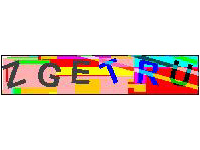

# cnn_captcha
use CNN recognize captcha by tensorflow.  
本项目针对字符型图片验证码，使用tensorflow实现卷积神经网络，进行验证码识别。  
项目封装了比较通用的**校验、训练、验证、识别、API模块**，极大的减少了识别字符型验证码花费的时间和精力。  

# 目录
<a href="#项目介绍">1 项目介绍</a>  
<a href="#关于验证码识别">1.1 关于验证码识别</a>  
<a href="#目录结构">1.2 目录结构</a>  
<a href="#依赖">1.3 依赖</a>  
<a href="#模型结构">1.4 模型结构</a>  
<a href="#如何使用">2 如何使用</a>  
<a href="#数据集">2.1 数据集</a>  
<a href="#配置文件">2.2 配置文件</a>  
<a href="#验证和拆分数据集">2.3 验证和拆分数据集</a>  
<a href="#训练模型">2.4 训练模型</a>  
<a href="#批量验证">2.5 批量验证</a>  
<a href="#启动WebServer">2.6 启动WebServer</a>  
<a href="#调用接口">2.7 调用接口</a>  
<a href="#说明">3 说明</a>  
<a href="#时间表">4 时间表</a>  

# 1 项目介绍
## 1.1 关于验证码识别
验证码识别大多是爬虫会遇到的问题，也可以作为图像识别的入门案例。目前通常使用如下几种方法：  

| 方法名称 | 相关要点 |
| ------ | ------ |
| tesseract | 仅适合识别没有干扰和扭曲的图片，训练起来很麻烦 |
| 其他开源识别库 | 不够通用，识别率未知 |
| 付费OCR API | 需求量大的情形成本很高 |
| 图像处理+机器学习分类算法 | 涉及多种技术，学习成本高，且不通用 |
| 卷积神经网络 | 一定的学习成本，算法适用于多类验证码 |

这里说一下使用传统的**图像处理和机器学习算法**，涉及多种技术：  

1. 图像处理
- 前处理（灰度化、二值化）
- 图像分割
- 裁剪（去边框）
- 图像滤波、降噪
- 去背景
- 颜色分离
- 旋转
2. 机器学习
- KNN
- SVM

使用这类方法对使用者的要求较高，且由于图片的变化类型较多，处理的方法不够通用，经常花费很多时间去调整处理步骤和相关算法。  
而使用**卷积神经网络**，只需要通过简单的前处理，就可以实现大部分静态字符型验证码的端到端识别，效果很好，通用性很高。  

这里列出目前**常用的验证码**生成库：
>参考：[Java验证全家桶](https://www.cnblogs.com/cynchanpin/p/6912301.html)  

| 语言 | 验证码库名称 | 链接 | 样例 |
| ------ | ------ | ------ | ------ |
| Java | JCaptcha | [示例](https://jcaptcha.atlassian.net/wiki/spaces/general/pages/1212427/Samples+tests)  |    |
| Java | JCaptcha4Struts2 |  |  |
| Java | SimpleCaptcha | [例子](https://www.oschina.net/p/simplecaptcha)   |    |
| Java | kaptcha | [例子](https://github.com/linghushaoxia/kaptcha) |    |
| Java | patchca |  |  |
| Java | imageRandom |  |  |  
| Java | iCaptcha |  |  |  
| Java | SkewPassImage |  |  |  
| Java | Cage |  |   |
| Python | captcha | [例子](https://github.com/nickliqian/cnn_captcha/blob/master/gen_image/gen_sample_by_captcha.py) |  |
| PHP | Gregwar/Captcha | [文档](https://github.com/Gregwar/Captcha) |  |
| PHP | mewebstudio/captcha | [文档](https://github.com/mewebstudio/captcha) |  |

## 1.2 目录结构

| 序号 | 文件名称 | 说明 |
| ------ | ------ | ------ |
| 1 | sample.py | 配置文件 |
| 2 | verify_and_split_data.py | 验证数据集和拆分数据为训练集和测试集 |
| 3 | train_model.py | 训练模型 |
| 4 | test_batch.py | 批量验证 |
| 5 | recognition_object.py | 封装好的识别类 |
| 6 | recognize_api.py | 使用flask写的提供在线识别功能的接口 |
| 7 | recognize_online.py | 使用接口识别的例子 |
| 8 | sample文件夹  | 存放数据集 |
| 9 | model文件夹 | 存放模型文件 |
| 10 | gen_image/gen_sample_by_captcha.py | 生成验证码的脚本 |

## 1.3 依赖
```
pip3 install tensorflow flask requests PIL matplotlib easydict
```
## 1.4 模型结构

| 序号 | 层级 |
| :------: | :------: |
| 输入 | input |
| 1 | 卷积层 + 池化层 + 降采样层 + ReLU  |
| 2 | 卷积层 + 池化层 + 降采样层 + ReLU  |
| 3 | 卷积层 + 池化层 + 降采样层 + ReLU  |
| 4 | 全连接 + 降采样层 + Relu   |
| 5 | 全连接 + softmax  |
| 输出 | output  |

# 2 如何使用
## 2.1 数据集
原始数据集可以存放在`./sample/origin`目录中  
为了便于处理，图片最好以`2e8j_17322d3d4226f0b5c5a71d797d2ba7f7.jpg`格式命名（标签_序列号.后缀）

## 2.2 配置文件
创建一个新项目前，需要自行**修改相关配置文件**
```
图片文件夹
sample_conf.origin_image_dir = "./sample/origin/"  # 原始文件
sample_conf.train_image_dir = "./sample/train/"   # 训练集
sample_conf.test_image_dir = "./sample/test/"   # 测试集
sample_conf.api_image_dir = "./sample/api/"   # api接收的图片储存路径
sample_conf.online_image_dir = "./sample/online/"  # 从验证码url获取的图片的储存路径

# 模型文件夹
sample_conf.model_save_dir = "./model/"  # 训练好的模型储存路径

# 图片相关参数
sample_conf.image_width = 80  # 图片宽度
sample_conf.image_height = 40  # 图片高度
sample_conf.max_captcha = 4  # 验证码字符个数
sample_conf.image_suffix = "jpg"  # 图片文件后缀

# 验证码字符相关参数
# 验证码识别结果类别
sample_conf.char_set = ['0', '1', '2', '3', '4', '5', '6', '7', '8', '9', 'a', 'b', 'c', 'd', 'e', 'f', 'g', 'h', 'i',
                        'j', 'k', 'l', 'm', 'n', 'o', 'p', 'q', 'r', 's', 't', 'u', 'v', 'w', 'x', 'y', 'z']

# 验证码远程链接
sample_conf.remote_url = "https://www.xxxxx.com/getImg"
```
具体配置的作用会在使用相关脚本的过程中提到

## 2.3 验证和拆分数据集
此功能会校验原始图片集的尺寸和测试图片是否能打开，并按照19:1的比例拆分出训练集和测试集。  
所以需要分别创建和指定三个文件夹：origin，train，test用于存放相关文件。

也可以修改为不同的目录，但是最好修改为绝对路径。  
文件夹创建好之后，执行以下命令即可：
```
python3 verify_and_split_data.py
```

## 2.4 训练模型
创建好训练集和测试集之后，就可以开始训练模型了。  
这里不具体介绍tensorflow安装相关问题，直奔主题。  
确保图片相关参数和目录设置正确后，执行以下命令开始训练：
```
python3 train_model.py
```
也可以调用类开始训练或执行一次简单的识别演示
```
from train_model import TrainModel
from sample import sample_conf

# 导入配置
train_image_dir = sample_conf["train_image_dir"]
char_set = sample_conf["char_set"]
model_save_dir = sample_conf["model_save_dir"]

tm = TrainModel(train_image_dir, char_set, model_save_dir)

tm.train_cnn()  # 执行训练

tm.recognize_captcha()  # 识别演示

```

## 2.5 批量验证
使用测试集的图片进行验证，输出准确率。  
```
python3 test_batch.py
```
也可以调用类进行验证
```
from test_batch import TestBatch
from sample import sample_conf

# 导入配置
test_image_dir = sample_conf["test_image_dir"]
model_save_dir = sample_conf["model_save_dir"]
char_set = sample_conf["char_set"]
total = 100  # 验证的图片总量

tb = TestBatch(test_image_dir, char_set, model_save_dir, total)
tb.test_batch()  # 开始验证

```

## 2.6 启动WebServer
项目已经封装好加载模型和识别图片的类，启动web server后调用接口就可以使用识别服务。  
启动web server
```
python3 recognize_api.py
```
接口url为`http://127.0.0.1:6000/b`

## 2.7 调用接口
使用requests调用接口:
```
url = "http://127.0.0.1:6000/b"
files = {'image_file': (image_file_name, open('captcha.jpg', 'rb'), 'application')}
r = requests.post(url=url, files=files)
```
返回的结果是一个json：
```
{
    'time': '1542017705.9152594',
    'value': 'jsp1',
}
```
文件`recognize_online.py`是使用接口在线识别的例子

# 3 说明
1. 目前没有保存用于tensorboard的日志文件

# 4 时间表
2018.11.12 - 初版Readme.md
2018.11.21 - 加入关于验证码识别的一些说明